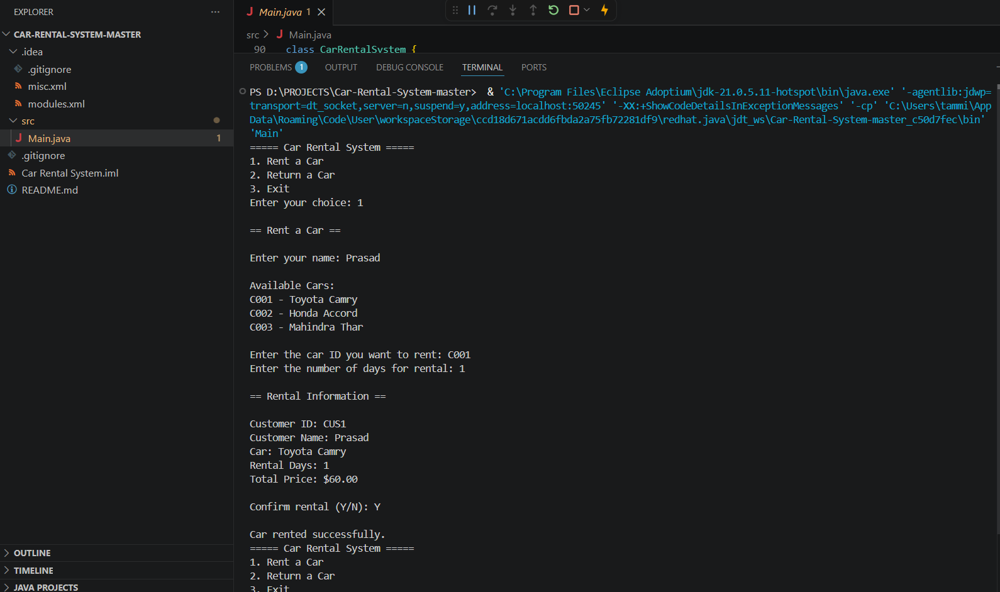

# 🚗 Car Rental System

A Java-based Car Rental Management System developed using Object-Oriented Programming (OOP) principles. This console application enables users to rent and return cars while managing customer and vehicle information efficiently.

## ✨ Features

 🚀 Rent a Car through an interactive console interface
🔁 Return rented cars and update availability
👥 Manage customer records
🚗 Manage cars, brands, models, and pricing details
📝 Track rental history and rental durations

## 📸 Application Demo

## 🛠️ Tech Stack

* Java
* Object-Oriented Programming (OOP)
* Collections Framework
* Console-Based User Interface

## 🔮 Future Enhancements

🤝 Support multiple customers renting the same car simultaneously.
⏰ Implement date-based pricing adjustments.
🎨 Develop a graphical user interface (GUI) for enhanced user experience.